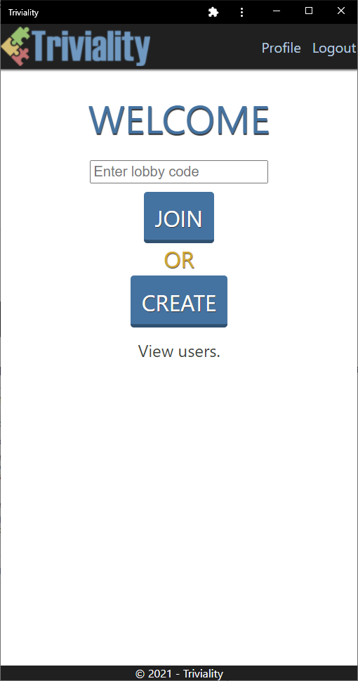
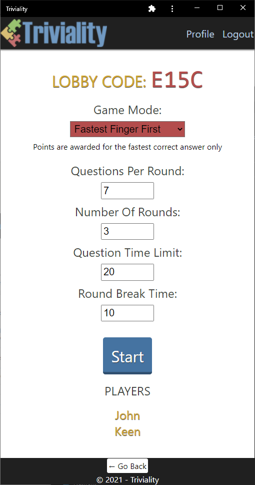
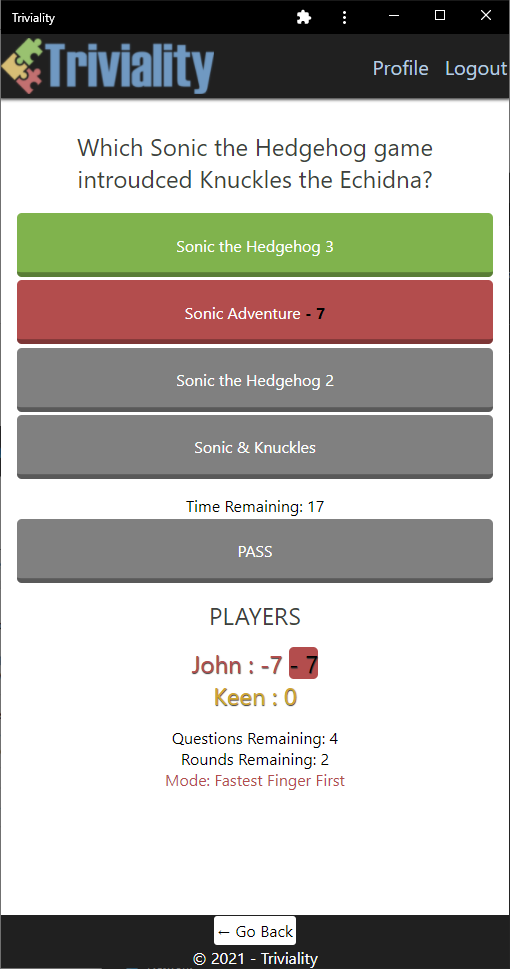
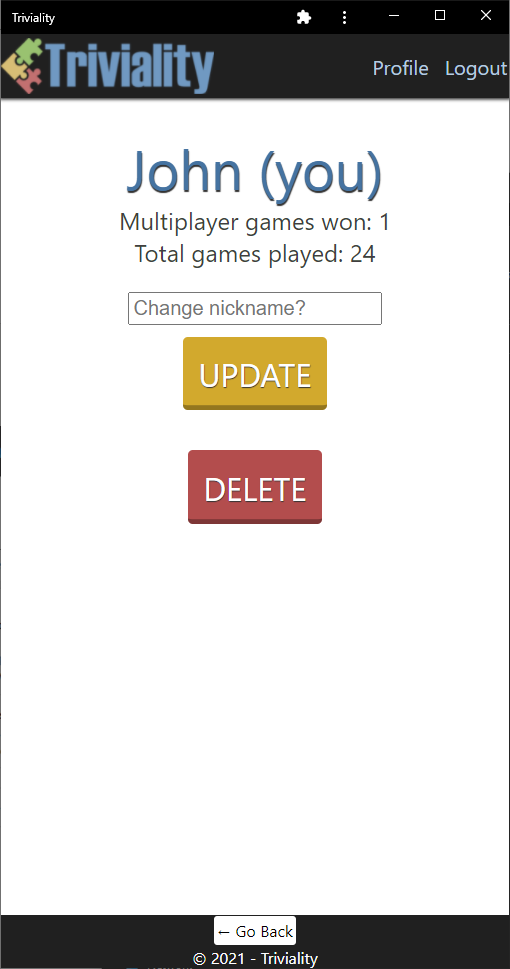

# Triviality

## Description

Introducing Triviality, a new quiz app for challenging your friends and crushing your foes.

- All participants see the same question
- Points are awarded or deducted based on correctness of response
- Multiple game modes
- Time limit for each question
- Optional break between rounds
- Player profiles displaying number of games and multiplayer wins

Link to the live app: [view app](https://dandy-triviality.herokuapp.com/).

## Table of Contents

- [Installation](#installation)
- [Usage](#usage)
- [License](#license)
- [Contributing](#contributing)
- [Credits](#credits)
- [Questions](#questions)
- [Presentation](#presentation)

## Installation

In chrome, click on 'install app' in the drop down menu on the top right.

## Usage

Once you sigup and login, you can create a lobby or join an existing one using its unique 4 character code.

When questions are asked, click on your desired response or pass.

Total games played as well as multiplayer wins are recorded on your profile page for others to see.

## License

This repository is licensed under the [GPL-3.0](https://opensource.org/licenses/GPL-3.0) license.

## Contributing

No contributions at this time.

## Credits

- Open Trivia Databse
- Socket.IO
- Heroku
- Mongoose
- Express
- React
- Node.js

## Questions

If you have any questions, you can message me at:

- https://github.com/DandyCodes

## Presentation

- View the Triviality presentation - https://docs.google.com/presentation/d/1_qlsMSPxXf7-iKw8yDZ-gSPIvAxXei7H_0frNfQgPBA/edit?usp=sharing
